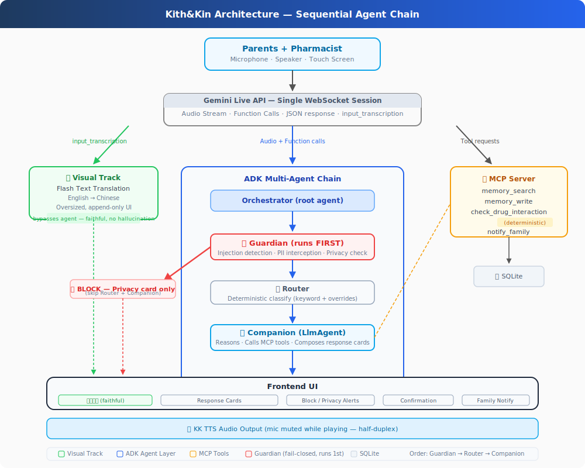

# Kith&Kin: The One Who Shows Up When You Can't

**Track:** Concierge Agents  
**Team:** Kith&Kin

---

## The Problem

Every immigrant family knows this moment: your parent is alone at a pharmacy counter while you are at work. They may not fully understand the pharmacist, may not know how to explain allergies or current medications in English, and may leave without a clear record of what was said.

A normal translation app helps with words, but the pharmacy counter is not just a word-by-word translation problem. The parent needs faithful translation, safe response options, privacy protection, memory of previous visits, and a way to involve family only after consent.

Kith&Kin is built for that gap. It is a real-time AI companion for elderly Chinese-speaking parents. It helps them understand the pharmacist, choose safe pharmacist-facing questions, review sensitive information before sharing it, and keep a structured summary of the visit.

---

## Why an Agent?

This problem needs an agent because the system must react differently depending on the situation.

If the pharmacist says something routine, Kith&Kin should simply translate it faithfully. If the pharmacist asks about allergies or current medicines, Kith&Kin should retrieve only authorised context and ask the parent before sharing it. If the pharmacist asks for payment or identity details, Kith&Kin should treat it as a privacy-sensitive moment. If the pharmacist provides several product options, Kith&Kin should organize only the pharmacist-stated facts without ranking or recommending them.

These behaviours require state, routing, tools, confirmation, and safety gates. That is why Kith&Kin is an agentic system rather than a translation-only app.

---

## Architecture

The current implementation uses a React frontend, a FastAPI backend, a single backend WebSocket runtime, Google Gemini adapters, ADK-style agent orchestration, MCP-style tools, and SQLite-backed repositories.

The architecture separates two tracks from the same conversation:

1. **Faithful translation track.** Final transcript events are passed to the `TranslationService`. The frontend renders large Chinese captions. Agent advice, risk hints, and response cards are not allowed to enter this translation field.

2. **Safety and action track.** Router and Guardian process final turns in parallel. Router classifies the turn, while Guardian checks privacy, medical, and safety boundaries. If a turn is blocked, Companion does not continue. If the turn needs support, Companion can use bounded tools and propose response cards.

3. **Tool and persistence layer.** The MCP-style adapter exposes `memory_search`, `memory_write`, `check_drug_interaction`, and `notify_family`. SQLite repositories store demo-safe profile, memory, session, ticket, trace, visit, and notification data.

The core invariant is:

> One real-time conversation runtime, separate faithful translation, backend-owned actions, explicit confirmation, and no medical decision-making by the AI.

---

## Three Course Concepts

### 1. ADK multi-agent orchestration

Kith&Kin uses separate agent responsibilities instead of one all-powerful chatbot.

- **Router** classifies the final turn into paths such as passive translation, pharmacy risk, privacy risk, response needed, family action, or fallback.
- **Guardian** reviews final turns and proposed actions for privacy, medical safety, consent, and prompt-injection risks.
- **Companion** runs only when a safe route needs agent assistance. It can search authorised memory, request a deterministic drug interaction check, and propose response cards.

The important design point is that Guardian is not just a Router branch. Router and Guardian process final turns in parallel, and blocking decisions prevent unsafe continuation. This matches the runtime contract and the current `TurnOrchestrator` implementation.

### 2. MCP-style tools

The Companion does not invent medical or profile facts. It uses bounded tools through the backend tool adapter.

| Tool | Purpose | Safety rule |
|---|---|---|
| `memory_search` | Reads authorised profile, allergy, medication, and visit-summary snippets. | Read-only. Missing data means unknown. |
| `check_drug_interaction` | Checks curated demo drug-interaction facts after a concrete drug name is detected. | Produces pharmacist-confirmation prompts, not medical instructions. |
| `memory_write` | Saves a reviewed visit summary. | Requires confirmed backend-owned action. |
| `notify_family` | Records or sends a family notification through the notification adapter. | Requires confirmed backend-owned action. |

This keeps external capabilities scoped and auditable.

### 3. Security and human confirmation

Kith&Kin is designed around human-in-the-loop control.

Selecting a response card has zero side effects. The backend must issue and validate a confirmation ID before speech, memory write, or family notification. The frontend sends identifiers, not executable action text or tool arguments.

The system also separates card confirmation from audio delivery. `card.confirmed` means the backend accepted the confirmation. The actual speaking lifecycle is represented by `audio.muted`, `audio.speaking`, binary audio frames, and completion or failure events.

---

## Product Experience

The frontend is designed as a pharmacy conversation workspace for elderly users.

The main screen shows large Chinese captions, a product-options table when the pharmacist gives multiple options, simple response cards, and an explicit confirmation panel before KK speaks. The right-side conversation log keeps Chinese primary and English secondary for context. There are also control paths such as self-speak, repeat, and please-wait.

For product comparison, Kith&Kin does not recommend. It only displays pharmacist-stated facts such as product name, price, use, directions, and cautions. This is important because the pharmacist remains the medical authority.

---

## Demo Flow

A typical demo can show the following sequence:

1. The pharmacist speaks in English.
2. Kith&Kin shows a faithful Chinese translation.
3. Router and Guardian process the final turn.
4. If the pharmacist asks about a medicine or allergy, Companion retrieves authorised context or asks for clarification.
5. Kith&Kin renders response cards in Chinese.
6. The parent selects a card.
7. The parent confirms before KK speaks or performs any action.
8. If the pharmacist provides several products, Kith&Kin renders a neutral product table based only on pharmacist-stated facts.
9. At the end, Kith&Kin shows a structured visit summary for review before memory save or family notification.

---

## Evaluation

The repo now contains **24 executable eval cases** in `evals/cases.json`. These cases are derived from the architecture and runtime contracts.

They cover:

- faithful translation without advice;
- medicine-risk routing;
- allergy and profile-context confirmation;
- credit-card and prompt-injection blocking;
- response-card selection with zero side effects;
- duplicate confirmation idempotency;
- half-duplex audio ordering;
- translation timeout fallback;
- memory write and family notification after confirmation only;
- cross-session recall;
- redacted privacy traces;
- pharmacist-stated product option rendering;
- overseas medicine similarity without guessing;
- browser trace replay for conversation-log purity, summary, audio delivery, and speaker attribution.

The eval suite matters because a demo can appear correct while still violating a hidden safety boundary. The evals check both final output and the event/tool trajectory.

---

## Project Journey

The project moved from a high-level pharmacy assistant idea into a contract-driven implementation.

The team first defined the product goal and safety boundaries: faithful translation, no medical advice, no automatic sensitive disclosure, and confirmation before outward actions. Then the team built runtime contracts for events, response cards, and MCP tools. The implementation followed those contracts through a FastAPI backend, React frontend, SQLite persistence layer, ADK-style agent orchestration, and deterministic tests.

A key learning was that product-grade vibe coding is not about generating more code. It is about keeping specs, code, tests, and evals aligned. In Kith&Kin, the important engineering work is the state machine: every visible UI state must correspond to a real backend event, not a frontend guess.

---

## Repository

`github.com/Alanho2025/Kith-Kin`

The repository includes the backend, frontend, runtime contracts, eval suite, Playwright E2E tests, architecture documents, product goal, and demo writeup.
